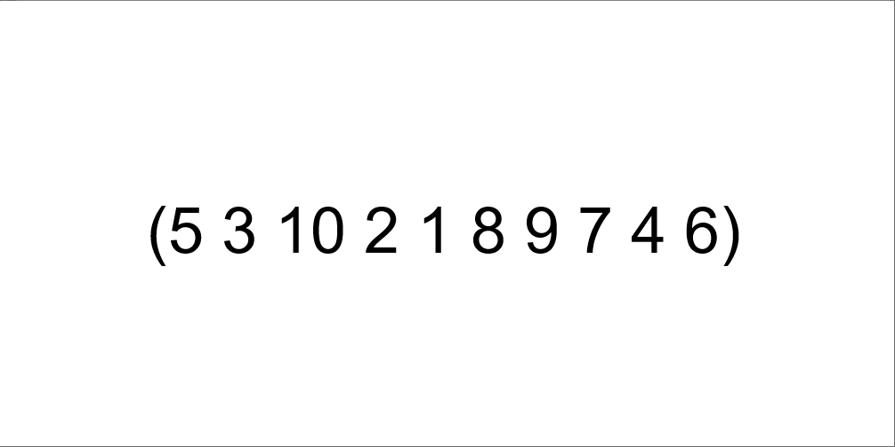
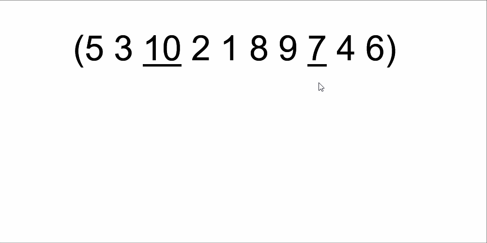
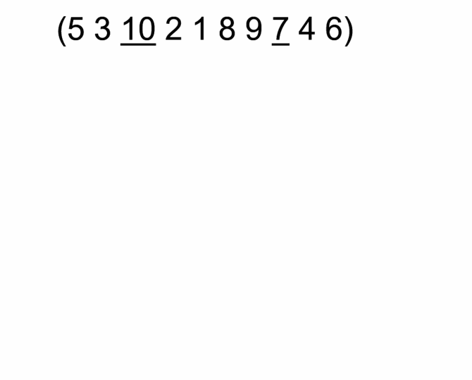
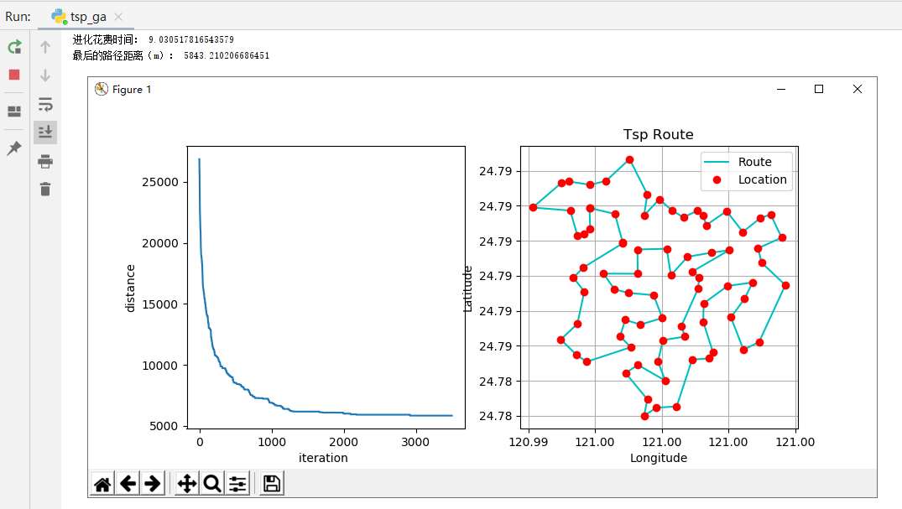

# 遗传算法解决TSP问题
动图可能要梯子才能显示，可以去[我的博客](https://blog.csdn.net/github_35751574/article/details/102886744)
## 核心部分伪代码
```
population_cur = init_population()
# 计算当前种群的适应值
fitness = get_fitness(population_cur)
while 不满足终止条件：
	# 保留一部分父代精英
	population_next = select_sorted_population(fitness, population_cur, elite_size)
	# 杂交
    for i in range(population_size):
    	# 这里可以自己加入杂交概率
        p1, p2 = selection(fitness, 2)  # 使用轮盘赌选择算子 随机选两个作为父母
        child1, child2 = crossover(population_cur[p1], population_cur[p2])

        # 对孩子进行变异
        if random.random() < p_mutation:
            child1 = mutations.select_best_mutaion(child1, distmat)
        if random.random() < p_mutation:
            child2 = mutations.select_best_mutaion(child2, distmat)
		
        population_next.append(child1)
        population_next.append(child2)
        # 这时一共有种群大小*四分之五个个体，从中选出下一代的种群
        population_next = select_sorted_population(get_fitness(population_next), population_next, population_size)
	 	# 换代
        population_cur = population_next
```

## 采用了一种效果比较好的变异方法
对一个待变异的个体A，分别进行`滑动变异`，`翻转变异`，`irgibnnm变异`，取三种变异结果最好的那种[[1]](https://arxiv.org/ftp/arxiv/papers/1801/1801.07233.pdf)

### 滑动变异
随机生成两个下标a,b （a<b）; 将s[a]挪到s[b]后面

演示动图：

### 翻转变异
随机生成两个下标a,b ; 将s[a]到s[b]之间的序列倒过来

翻转变异也叫2变换法，演示动图:

### irgibnnm变异
先对序列进行一次翻转变异；随机挑选一个城市，把他交换到地图距离与他最近的城市附近去，文献中的附近是±5

这种变异方法的实验结果好像不如文献中展示的结果那么好，可能是我实现错了？演示动图：


## 运行与结果
运行gsp_ga.py文件即可

数据集用的是78个点[[2]](https://github.com/tnlin/PokemonGo-TSP/tree/master/data)，在我的电脑上大概跑10s左右，印象中最优距离是5400m左右

## 遗传算法完整代码
[github完整代码](https://github.com/nairoj/tsp_ga)

## 参考
[1] [Improving TSP Solutions Using GA with a New Hybrid Mutation Based on Knowledge and Randomness](https://arxiv.org/ftp/arxiv/papers/1801/1801.07233.pdf)
[2] [github大佬模拟退火解决tsp问题](https://github.com/tnlin/PokemonGo-TSP/tree/master/data)
